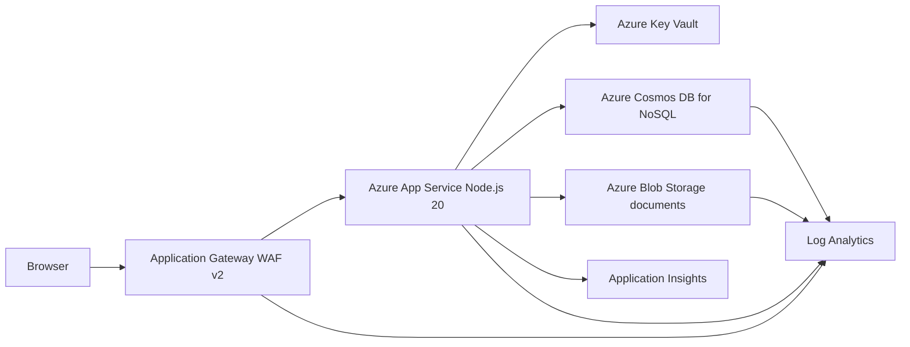
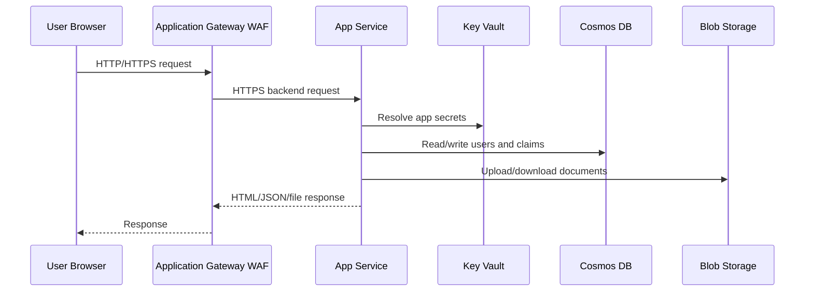

# Azure Deployment Guide

This guide deploys the monolithic Node.js insurance claims portal to Azure App Service behind Azure Application Gateway WAF v2.

The app code is not changed by these deployment assets. The current app expects Cosmos DB keys and a Blob Storage connection string, so the deployment stores those values in Key Vault and passes them to App Service with Key Vault references.

## Architecture



## Azure Resources

| Resource | Purpose |
| --- | --- |
| Resource Group | Holds all deployment resources. |
| Virtual Network | Provides network boundary for Application Gateway, App Service integration, and private endpoints. |
| Application Gateway WAF v2 | Public entry point and web application firewall. |
| App Service Plan | Linux compute plan for the Node.js app. |
| App Service | Runs the monolithic Express/EJS application. |
| Cosmos DB for NoSQL | Stores users, claims, claim status, and admin feedback. |
| Storage Account | Stores uploaded claim documents only. |
| Blob Container | Private container named `insurance-documents`. |
| Key Vault | Stores Cosmos key, Blob connection string, session secret, and demo passwords. |
| Managed Identity | Allows App Service to resolve Key Vault references. |
| Log Analytics | Central log destination. |
| Application Insights | App performance and request telemetry. |

## Network Design

Default CIDR plan:

| Subnet | CIDR | Purpose |
| --- | --- | --- |
| `appgw-subnet` | `10.42.1.0/24` | Required dedicated subnet for Application Gateway. |
| `appservice-integration-subnet` | `10.42.2.0/24` | Delegated subnet for App Service VNet integration. |
| `private-endpoint-subnet` | `10.42.3.0/24` | Reserved for private endpoints. |

Traffic flow:



The script restricts App Service inbound access to the Application Gateway public IP. For stricter production isolation, extend the solution with App Service Private Endpoint and private DNS for `privatelink.azurewebsites.net`.

## Security Model

- Application Gateway WAF runs in prevention mode with OWASP rules.
- App Service is HTTPS-only and has public access restricted to Application Gateway.
- Blob container public access is disabled.
- Storage uses secure transfer and TLS 1.2 minimum.
- Storage soft delete, container soft delete, and blob versioning are enabled.
- Key Vault uses RBAC authorization, purge protection, and soft delete retention.
- App Service uses a system-assigned managed identity.
- The managed identity receives `Key Vault Secrets User` so it can resolve Key Vault references.
- The deployer temporarily receives `Key Vault Secrets Officer` to create secrets during deployment.

Current tradeoff:

The application code currently uses Cosmos key and Storage connection string environment variables. For that reason, the deployment stores secrets in Key Vault and injects them through Key Vault references. A future hardening step is to update the app code to use managed identity directly for Cosmos DB and Blob Storage SDK clients.

## Deployment

From the repo root:

```bash
cp azure/.env.azure.example azure/.env.azure
```

Edit `azure/.env.azure`, then run:

```bash
az login
az account set --subscription "<SUBSCRIPTION_ID>"
bash azure/deploy.sh
```

The script creates a zip package and deploys it to App Service.

## Validation

Run:

```bash
bash azure/validate.sh
```

Manual validation commands:

```bash
az webapp show -g <resource-group> -n <app-name> -o table
az network application-gateway show-backend-health -g <resource-group> -n <app-gateway-name> -o table
curl -i http://<application-gateway-public-ip>/health
az cosmosdb sql container show -g <resource-group> -a <cosmos-account> -d insurance-claims -n claims -o table
az storage container show --name insurance-documents --connection-string "<storage-connection-string>" -o table
```

Expected health output:

```json
{"status":"ok"}
```

## Operations Runbook

Common operations:

- Restart app: `az webapp restart -g <resource-group> -n <app-name>`
- Stream logs: `az webapp log tail -g <resource-group> -n <app-name>`
- Check backend health: `az network application-gateway show-backend-health -g <resource-group> -n <app-gateway-name>`
- Scale App Service: `az appservice plan update -g <resource-group> -n <plan-name> --sku P2V3`
- Scale Cosmos throughput: `az cosmosdb sql container throughput update -g <resource-group> -a <cosmos-account> -d insurance-claims -n claims --throughput 1000`

## Monitoring

Configured monitoring:

- App Service HTTP, console, and app logs to Log Analytics
- Application Gateway access, performance, and firewall logs
- Cosmos DB data plane and query runtime logs
- Storage blob read/write/delete logs
- Application Insights for app telemetry
- Baseline alerts for App Service 5xx and Cosmos throttling

Recommended extra alerts:

- Application Gateway unhealthy backend count > 0
- WAF blocked request spike
- App Service CPU or memory above 80 percent
- Storage availability below target
- Cosmos normalized RU consumption above 80 percent

## Disaster Recovery

Cosmos DB:

- The script enables periodic backup.
- For production, consider multi-region writes or adding a failover region.
- Use session consistency unless the business requires stronger consistency.

Blob Storage:

- Default script setting uses `Standard_RAGZRS`.
- Uploaded documents are zone-redundant in the primary region and geo-replicated to the paired Azure region with read access.
- Blob soft delete and versioning protect against accidental deletes or overwrites.

App Service:

- Redeploy from the repo package.
- Keep `azure/.env.azure` values stored securely outside the repo.
- For higher availability, deploy a second regional stamp and put Azure Front Door in front.

## Troubleshooting

Application Gateway returns 502:

```bash
az network application-gateway show-backend-health -g <resource-group> -n <app-gateway-name> -o table
az webapp log tail -g <resource-group> -n <app-name>
```

Key Vault references are not resolving:

```bash
az webapp identity show -g <resource-group> -n <app-name>
az role assignment list --assignee <principal-id> --scope <key-vault-resource-id> -o table
az webapp config appsettings list -g <resource-group> -n <app-name> -o table
```

Cosmos connection fails:

```bash
az cosmosdb show -g <resource-group> -n <cosmos-account> --query documentEndpoint -o tsv
az cosmosdb keys list -g <resource-group> -n <cosmos-account> --type keys
az cosmosdb sql container show -g <resource-group> -a <cosmos-account> -d insurance-claims -n claims
```

Document upload fails:

```bash
az storage account show -g <resource-group> -n <storage-account> -o table
az storage container show --name insurance-documents --connection-string "<connection-string>"
az webapp log tail -g <resource-group> -n <app-name>
```

## Cost Guidance

- App Service `P1V3` supports VNet integration and production features. Use lower SKUs only for demos.
- Cosmos DB starts at 400 RU/s in the script. Increase only when throttling or latency requires it.
- Application Gateway WAF v2 has a meaningful fixed cost. Stop/delete demo environments when not in use.
- RA-GRS storage costs more than LRS but supports cross-region document durability.
- Log Analytics cost depends on ingestion volume and retention.

## Cleanup

```bash
bash azure/cleanup.sh
```

Cleanup deletes the whole resource group, including databases and uploaded documents.

## Production Readiness Checklist

- Replace demo login with Microsoft Entra ID.
- Add a custom domain and HTTPS listener on Application Gateway.
- Confirm WAF false positives before long-term prevention mode.
- Move from Cosmos keys and Blob connection strings to managed identity in app code.
- Add private endpoints for Cosmos DB, Storage, Key Vault, and optionally App Service.
- Configure alert action groups for email/SMS/ITSM.
- Document RTO and RPO.
- Run restore tests for Cosmos DB and Blob Storage.
- Load test claim submission and admin review flows.
- Review costs after the first week of production telemetry.
